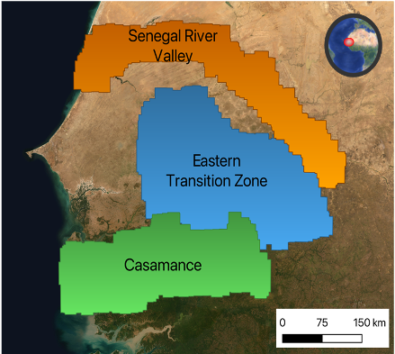

# Senegal LCLUC TensorFlow

[](https://zenodo.org/badge/latestdoi/474016543)


[](https://github.com/psf/black)
[](https://coveralls.io/github/nasa-nccs-hpda/senegal-lcluc-tensorflow?branch=main)

Python library to process and classify remote sensing imagery by means of GPUs and CPU parallelization for high performance and commodity base environments. This repository focuses in using CNNs for the inference of very
high-resolution remote sensing imagery in Senegal.


Figure 1. Study area of this repository.

We are currently working on tutorials and documentations. Feel to follow this repository for documentation
updates and upcoming tutorials.

## Science Questions

- Can 2m VHR imagery enhance our understanding of changes in the extent, intensity and land use of agriculture and forestry in Senegal?
- How can we better take advantage of NASA’s HEC resources to apply Deep learning for land cover change monitoring?
- Can we scale-up Unet CNNs to compensate for the diversity of landscapes and images to map regional land cover?


Figure 2. Wet and dry seasonality for cluster of typical fields in Senegal, Photos from Collaborator Gray Tappan

## Downloading the Container

The container for this work can be downloaded from DockerHub. The container is deployed on a weekly basis
to take care of potential OS vulnerabilities. All CPU and GPU dependencies are baked into the container image
for end-to-end processing.

```bash
singularity build --sandbox /lscratch/$USER/container/tensorflow-caney docker://nasanccs/tensorflow-caney:latest
```

## Data Preprocessing

The data used in this work is provided by NGA through the NextView agreement. As long as you are part of this
agreement, you can get access to the WorldView imagery we have processed. We also work with Planet imagery
as part of this project, which is free of access through the NICFI program.

### Generate Tappan Squares

To generate training and small samples of data we generated the so called Tappan squares in honor of our
colleague Gray Tappan. These Tappan squares are 5000x5000 pixel squares, for an area of 10000x10000 m^2.
Generating Tappan squares can be achieved with the tapann_pipeline_cli.py script. Its execution is as follows:

```bash
singularity exec --env PYTHONPATH="/explore/nobackup/people/$USER/development/senegal-lcluc-tensorflow:/explore/nobackup/people/$USER/development/tensorflow-caney:/explore/nobackup/people/jacaraba/development" --nv -B /explore/nobackup/projects/ilab,/explore/nobackup/projects/3sl,$NOBACKUP,/explore/nobackup/people /lscratch/$USER/container/tensorflow-caney python /explore/nobackup/people/$USER/development/senegal-lcluc-tensorflow/senegal_lcluc_tensorflow/view/tappan_pipeline_cli.py -c /explore/nobackup/people/$USER/development/senegal-lcluc-tensorflow/projects/tappan_generation/configs-srlite/tappan_06.yaml
```

## Land Cover CNN Workflow

In this workflow we perform land cover segmentation using CNNs. The main steps from this workflow
are the preprocess, train, predict, and validate steps. The CLI binary is used to manage the execution
of these steps in the pipeline.

### Full Pipeline

Here we run the full pipeline for preprocess, train, and predict.

```bash
singularity exec --env PYTHONPATH="/explore/nobackup/people/$USER/development/senegal-lcluc-tensorflow:/explore/nobackup/people/$USER/development/tensorflow-caney" --nv -B /explore/nobackup/projects/ilab,/explore/nobackup/projects/3sl,$NOBACKUP,/lscratch,/explore/nobackup/people /lscratch/$USER/container/tensorflow-caney python /explore/nobackup/people/$USER/development/senegal-lcluc-tensorflow/senegal_lcluc_tensorflow/view/landcover_cnn_pipeline_cli.py -c /explore/nobackup/people/$USER/development/senegal-lcluc-tensorflow/projects/land_cover/configs/experiments/2023-AccuracyIncrease/global_standardization_256_crop_4band_short.yaml -d /explore/nobackup/people/$USER/development/senegal-lcluc-tensorflow/projects/land_cover/configs/experiments/2023-AccuracyIncrease/land_cover_512_otcb_50TS_cas-wcas-short.csv -s preprocess train predict
```

Another example:

```bash
singularity exec --env PYTHONPATH="/explore/nobackup/people/$USER/development/senegal-lcluc-tensorflow:/explore/nobackup/people/$USER/development/tensorflow-caney" --nv -B /explore/nobackup/projects/ilab,/explore/nobackup/projects/3sl,$NOBACKUP,/lscratch,/explore/nobackup/people /lscratch/$USER/container/tensorflow-caney python /explore/nobackup/people/$USER/development/senegal-lcluc-tensorflow/senegal_lcluc_tensorflow/view/landcover_cnn_pipeline_cli.py -c /explore/nobackup/people/$USER/development/senegal-lcluc-tensorflow/projects/land_cover/configs/experiments/2023-AccuracyIncrease/8bit_scale_256_crop_4band_short.yaml -d /explore/nobackup/people/$USER/development/senegal-lcluc-tensorflow/projects/land_cover/configs/experiments/2023-AccuracyIncrease/land_cover_512_otcb_50TS_cas-wcas-8bit-short.csv -s preprocess train predict
```

### Test

Generate metrics and statistics using test data.

```bash
singularity exec --env PYTHONPATH="/explore/nobackup/people/$USER/development/senegal-lcluc-tensorflow:/explore/nobackup/people/$USER/development/tensorflow-caney" --nv -B /explore/nobackup/projects/ilab,/explore/nobackup/projects/3sl,$NOBACKUP,/explore/nobackup/people /explore/nobackup/projects/ilab/containers/tensorflow-caney-2023.05 python /explore/nobackup/people/$USER/development/senegal-lcluc-tensorflow/senegal_lcluc_tensorflow/view/landcover_cnn_pipeline_cli.py -c /explore/nobackup/people/$USER/development/senegal-lcluc-tensorflow/projects/land_cover/configs/experiments/2023-GMU-V2/batch1/eCAS-wCAS-otcb-40/eCAS-wCAS-otcb-40.yaml -t '/explore/nobackup/projects/3sl/labels/landcover/2m_all_fixed/*.tif' -s test
```

### Validate

Generate metrics and statistics using validation data.

```bash
singularity exec --env PYTHONPATH="/explore/nobackup/people/$USER/development/senegal-lcluc-tensorflow:/explore/nobackup/people/$USER/development/tensorflow-caney" --nv -B /explore/nobackup/projects/ilab,/explore/nobackup/projects/3sl,$NOBACKUP,/lscratch,/explore/nobackup/people /lscratch/$USER/container/tensorflow-caney python /explore/nobackup/people/$USER/development/senegal-lcluc-tensorflow/senegal_lcluc_tensorflow/view/landcover_cnn_pipeline_cli.py -v '/explore/nobackup/projects/3sl/data/Validation/3sl-validation-database-20230412-all-three-agreed.gpkg'  -c /explore/nobackup/people/$USER/development/senegal-lcluc-tensorflow/projects/land_cover/configs/experiments/2023-GMU-V2/batch1/eCAS-wCAS-otcb-30/eCAS-wCAS-otcb-30.yaml  -s validate
```

## Land Use 1D CNN Workflow

In this workflow we perform land use object segmentation using CNNs.

### Setup

```bash
singularity exec --env PYTHONPATH="/explore/nobackup/people/$USER/development/senegal-lcluc-tensorflow:/explore/nobackup/people/$USER/development/tensorflow-caney" --nv -B /explore/nobackup/projects/ilab,/explore/nobackup/projects/3sl,$NOBACKUP,/lscratch,/explore/nobackup/people /lscratch/$USER/container/tensorflow-caney python /explore/nobackup/people/$USER/development/senegal-lcluc-tensorflow/senegal_lcluc_tensorflow/view/landuse_cnn_pipeline_cli.py -c /explore/nobackup/people/$USER/development/senegal-lcluc-tensorflow/projects/land_use/configs/landuse.yaml --gee-account 'id-sl-senegal-service-account@ee-3sl-senegal.iam.gserviceaccount.com' --gee-key '/home/$USER/gee/ee-3sl-senegal-8fa70fe1c565.json' -s setup
```

## Authors

- Jordan Alexis Caraballo-Vega, jordan.a.caraballo-vega@nasa.gov
- Margaret Wooten, margaret.wooten@nasa.gov
- Caleb S. Spradlin, caleb.s.spradlin@nasa.gov
- Minh Tri Le, mle35@gmu.edu 

## Installation

See the build [guide](requirements/README.md).

## Contributing

Please see our [guide for contributing to terragpu](CONTRIBUTING.md).

## References

[1] Raschka, S., Patterson, J., & Nolet, C. (2020). Machine learning in python: Main developments and technology trends in data science, machine learning, and artificial intelligence. Information, 11(4), 193.

[2] Paszke, Adam; Gross, Sam; Chintala, Soumith; Chanan, Gregory; et all, PyTorch, (2016), GitHub repository, <https://github.com/pytorch/pytorch>. Accessed 13 February 2020.

[3] Caraballo-Vega, J., Carroll, M., Li, J., & Duffy, D. (2021, December). Towards Scalable & GPU Accelerated Earth Science Imagery Processing: An AI/ML Case Study. In AGU Fall Meeting 2021. AGU.
